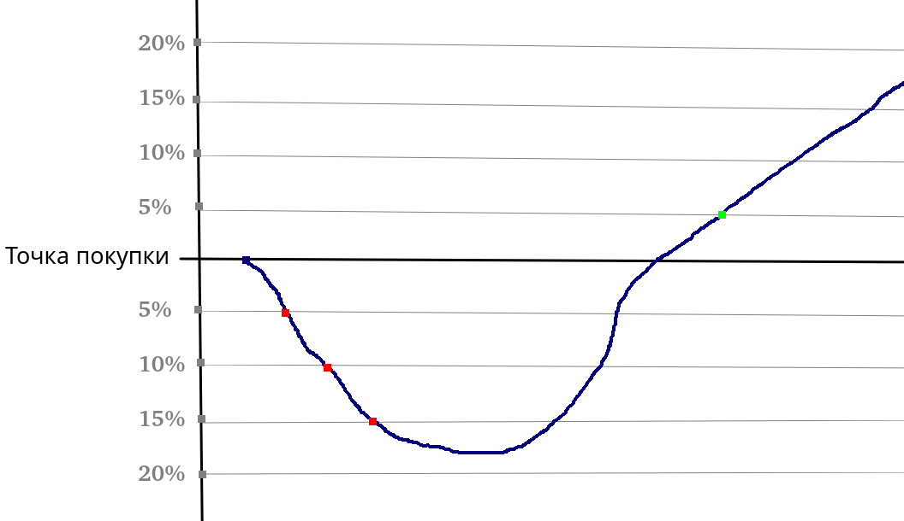

# Скрипт для биржи
Бот который будет осуществлять ребаланс выбранных монет 

1. Покупаешь монету через скрипт
Там фиксируется цена покупки и сколько купил.
2. Запускаешь скрипт

Красные точки это точки покупки монеты. При каждом понижении стоимости в 5% будет покупаться монета на 5% от баланса этой монеты.

Зеленая точка это когда стоимость монеты подымется выше первоначальной стоимости на 5% продадутся все монеты

После продажи монеты она перестает работать но остается в базе данных что бы посмотреть окупилась она или нет. В базе фиксируется все количество USDT которое было потрачено на нее



### Установка
1. Создать виртуальное окружение
    ```
    python -m venv venv
    source venv/bin/activate
    ```
2. Установить зависимости
    ```
    pip install -r requirements.txt
    ```
3. Заупуск
    ```
    python main.py -h
    ```
### Файл .env
```
API_KEY=публичный_ключ
API_SECRET=секретный_ключ

DEMO_API_KEY=публичный_ключ_демо_режима (не обязательно)
DEMO_API_SECRET=секретный_ключ_демо_режима (не обязательно)
```

### Софт
1. python 3.13
2. DBeaver Community
